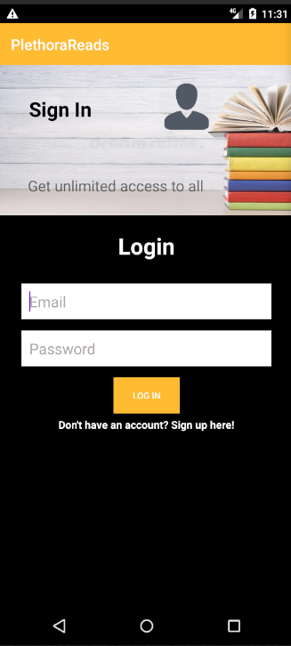
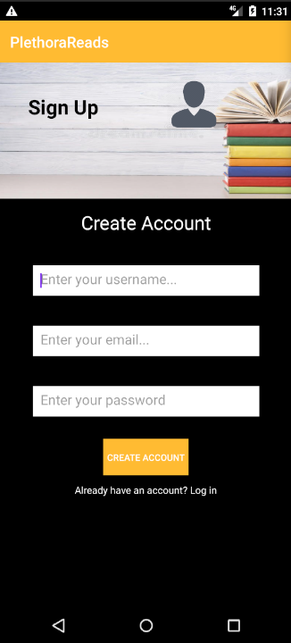
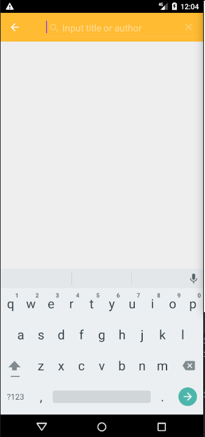
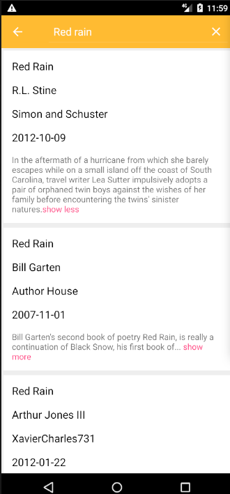

# PLETHORA READS
#### Plethora Reads is an app that sells novels of any genre at a considerable price.

## Demo







## Contribution
### Getting debug info via logcat :mag:
#### With a linux computer:
* enable USB-Debugging in your smartphones developer settings and connect it via USB
* open command prompt/terminal
* enter `adb logcat | grep "$(adb shell ps | awk '/com.nextcloud.client/{print $2}')" > logcatOutput.txt` to save the output to this file

**Note:** You must have [adb](https://developer.android.com/studio/releases/platform-tools.html) installed first!

#### On Windows:
* Download and install [Minimal ADB and fastboot](https://forum.xda-developers.com/t/tool-minimal-adb-and-fastboot-2-9-18.2317790/#post-42407269)
* Enable USB-Debugging in your smartphones developer settings and connect it via USB
* Launch Minimal ADB and fastboot
* Enter `adb shell ps | findstr com.nextcloud.client` and use the second place of this output (it is the first integer, e.g. `18841`) as processID in the following command:
* `adb logcat | findstr <processID> > %HOMEPATH%\Downloads\logcatOutput.txt` (This will produce a logcatOutput.txt file in your downloads)
* If the processID is 18841, an example command is: `adb logcat | findstr 18841 > %HOMEPATH%\Downloads\logcatOutput.txt` (You might cancel the process after a while manually: it will not be exited automatically.)

#### On a device (with root) :wrench:
* Open terminal app *(can be enabled in developer options)*
* Get root access via "su"
* Enter `logcat -d -f /sdcard/logcatOutput.txt`
* You will have to filter the output manually, as above approach is not working on device

or

* Use [CatLog](https://play.google.com/store/apps/details?id=com.nolanlawson.logcat) or [aLogcat](https://play.google.com/store/apps/details?id=org.jtb.alogcat)

**Note:** Your device needs to be rooted for this approach!


## Setup/Installation Requirements
* Fork/Clone the repository
```
   $ git clone https://github.com/andreassenmarvin/Plethora-reads.git
```
* Open your project on Android Studio.
* Run the project.

## Known Bugs
No known bugs
## Technologies Used
* Java
* Android
* Firebase
## Support and contact details
Incase of any contributions,query or issues,you can reach me through the email below:
machariamarvin625@gmail.com
### License
This project is licensed under the [MIT LICENSE](https://github.com/andreassenmarvin/Plethora-reads/blob/master/LICENSE)
